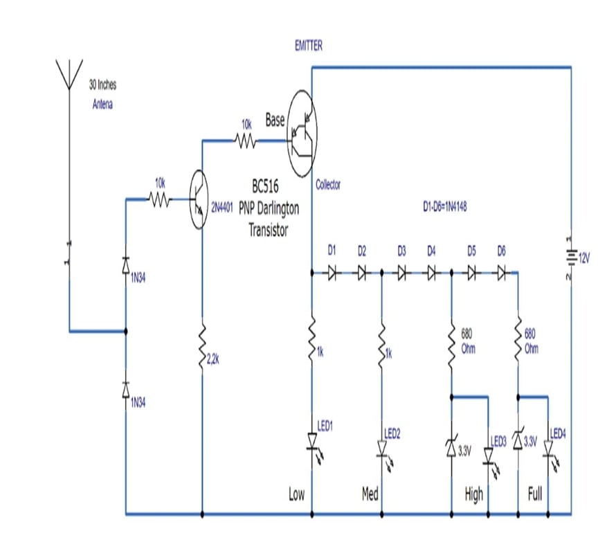

# 📡 Field Strength Meter using Transistors

A compact, low-cost RF field strength meter built using transistor-based circuitry. It detects and quantifies radio frequency (RF) signals, making it ideal for RF circuit testing, antenna tuning, and wireless signal optimization.

> 🎓 EC5302 – Electromagnetic Field and Waves  
> 🏫 MIT Campus, Anna University, Chennai – 600044  
> 📆 Jul 2023 - Nov 2023

---

## 🎯 Objective

To design and demonstrate a portable **Field Strength Meter** using discrete transistors for detecting and measuring the strength of electromagnetic fields in the RF range.

---

## 🧪 Working Principle

- Transistors act as **amplifiers and detectors** to capture RF signals.
- Signals are rectified and filtered to extract envelope data.
- The output is displayed via a **meter or digital interface** to represent RF field strength.

---

## ⚙️ Features

- ✅ **Low-cost** and easy-to-build circuit
- 📦 **Portable** for field measurements
- 📊 **Analog or digital output**
- 🧰 Transistor-based — no microcontroller needed
- 💡 Useful for HAM, RF labs, and telecom

---

## 🛠️ Components Used

| Component         | Description                                |
|------------------|--------------------------------------------|
| Transistors       | RF amplification and detection             |
| Antenna           | Captures the electromagnetic field         |
| Diodes & Capacitors | Signal rectification and smoothing     |
| Meter (analog/LED)| Displays the field strength                |
| Power Supply      | Battery (portable use) or 5V source        |

---

## 🖼️ Circuit Diagram

---

## 📄 Project Poster / Report

📘 [View Poster PDF](./Field_Strength_Meter_Report.pdf)

Includes:
- Abstract
- Circuit explanation
- Working principle
- Advantages & Applications

---

## 🚀 Applications

- 📶 **RF Engineering**: Signal testing, antenna tuning  
- 📡 **Telecom Optimization**: Measure signal coverage  
- 📻 **HAM Radio**: Analyze signal reception  
- 🧪 **Lab Work**: EMF/RF testing in academic settings  

---

## 👥 Team Members

- Yuvaraj V – 2022504554  
- Sham Ganesh V – 2022504023  
- Nisanth T – 2022504040  
- Madhan K – 2022504531  
- Surya A – 2022504311  
  

**Faculty Mentor**: Ms. P. Pavithra  
Department of Electronics Engineering, MIT Campus

---

## 🔗 Keywords

`Transistor` • `Antenna` • `Field Strength` • `RF Detection` • `EMF Meter` • `Diode Detector`

---

## 📜 License

Open for academic and non-commercial educational use. Attribution required.
